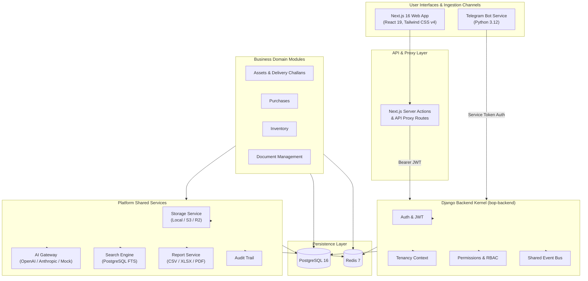

# 01. Project Overview & Scope

## System Purpose

**WWE OS** is an Enterprise Business Operations Platform tailored for single-operator business workflows (service providers, asset maintenance, and equipment logistics).

The platform combines multi-tenant infrastructure with modular business domain contexts tailored for a service provider:

- Equipment & Asset Movement via **Delivery Challans (DC)**.
- Automated **Purchase Bill Ingestion** via Telegram bot & OCR.
- **Service Equipment & Tools Tracking** for internal tools, spare parts, and equipment.
- **Document Management System (DMS)** with AI-powered summarization.

---

## Current Product Scope

To keep operations frictionless for a single-operator environment, specific enterprise complexities have been intentionally streamlined.

### In-Scope Features

- **Delivery Challan Engine:** Custom Word template rendering (`DC 26.docx`), free-text product inputs, customizable measurement units (Kg, Litre, Lot, Nos, Mtr, Set), free-text delivery site addresses, PDF generation, tamper-proof SHA-256 document hashing (`verification_hash`), deletion, and downloadable history.
- **Telegram Receipt Ingestion:** Automated purchase bill capture via Telegram bot, non-blocking Storage Service file save, structured AI OCR extraction via Platform AI Gateway (Gemini/OpenAI), auto-classification (Processed vs Needs Attention), and AI spend insights.
- **Service Tools & Equipment Tracking:** Internal spare parts, tools, and equipment tracking (no saleable product stock).
- **DMS Storage:** Document upload, categorization, local/cloud storage provider abstraction, and AI document summarization.
- **System Maintenance & Health:** Real-time `/healthz` diagnostics, API usage tracking, and system configuration metrics.
- **Dark/Light Theming:** Custom color palette with light mode (`t` key shortcut toggle).

### Intentionally Out-of-Scope (Streamlined)

- **Multi-Level Approval Workflows:** Removed multi-stage document approval states (draft, in-review, approved) to avoid blocking single-operator actions.
- **Inventory Low-Stock Threshold Alerts:** Removed reorder level tracking (`reorder_level`) and low-stock warning triggers.
- **Strict Product DB Validation on DCs:** Delivery Challans bypass forced inventory database checks, allowing arbitrary text items and custom quantities.
- **Complex Multi-User Access Gates:** While RBAC and permission infrastructure remain intact in the backend kernel, multi-user administration UI (Users, Roles, Permissions) is hidden for single-operator simplicity.

---

## Current Development Stage

- **Backend Kernel:** Production-Ready (Django 5.x, DRF, JWT Auth, Multi-Tenancy, Storage, AI Gateway, Audit, Search, Reporting).
- **Assets & Delivery Challans Module:** Active / Feature Complete (Free-text DCs, PDF rendering, SHA-256 verification hash, deletion, analytics header).
- **Purchases & Telegram Bot:** Active / Connected (Telegram ingestion live, OCR integration active).
- **DMS & Inventory:** Active / Streamlined.
- **Overall Stage:** **Stage 4 — Refinement & Operations**.

---

## System Architecture Diagram

The system follows a layered, modular monorepo architecture where business modules communicate with the central Django platform kernel and shared services.

