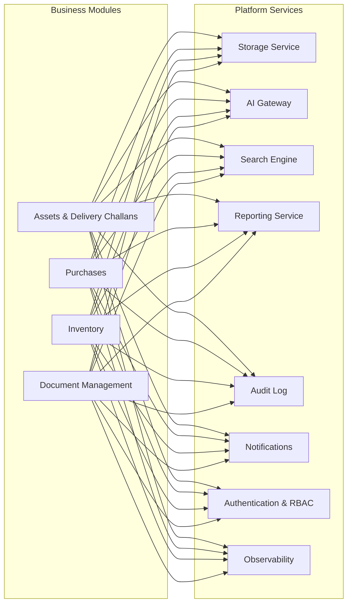

# 02. Platform Shared Services

The platform kernel (`platform/`) provides nine reusable shared capabilities. They contain **zero business logic**; every business module consumes them instead of re-implementing infrastructure.



---

## 1. Storage Service (`platform/storage`)

- **Provider Abstraction (`providers.py`):** Abstract `StorageProvider` interface implemented by `LocalStorageProvider` (local dev) and `S3CompatibleProvider` (Cloudflare R2, AWS S3, MinIO).
- **Core Method Signature:**
  ```python
  StorageService().store(
      data=bytes,
      filename=str,
      content_type=str,
      module=str,
      tenant=tenant_obj,
      uploaded_by=user_obj,
  ) -> StoredFile
  ```
- **Integrity & Scoping:** Computes SHA-256 digest (`sha256`), enforces MIME allowlists and size caps (`STORAGE_MAX_UPLOAD_MB`), and namespaces keys under `t/<tenant_id>/<module>/<yyyy>/<mm>/<uuid>-<filename>`.
- **Signed Downloads:** Serves files via Django-signed expiring tokens (`/api/v1/storage/download/?token=`) or S3 presigned URLs.

---

## 2. AI Gateway & Prompt Library (`platform/ai`)

- **Single Gateway:** Modules invoke `AIService.generate(...)`. Direct SDK imports in modules are strictly forbidden.
- **Provider Routing:** Supports OpenAI (Vision, GPT-4o), Anthropic (Claude), and a deterministic `mock` provider for testing.
- **Prompt Registry (`prompts.py`):** Code-defined, versioned prompts registered during module startup (`AppConfig.ready()`).
- **Usage & Rate Limits:** Tracks token counts and costs (`AIUsage`) per tenant/module/use-case, enforcing hourly tenant caps (`AI_TENANT_HOURLY_LIMIT`).

---

## 3. Search Engine (`platform/search`)

- **Adapter Architecture:** Modules register `SearchAdapter` instances in `ready()` defining document transformations and gating permissions.
- **Execution:** Full-text search (`SearchVector`, `SearchRank`) on PostgreSQL with fallback to portable pattern matching.
- **Security:** Tenant-isolated and permission-gated per index.

---

## 4. Reporting Service (`platform/reporting`)

- **Report Rendering:** Renders domain data into CSV, Excel (`openpyxl`), HTML, or PDF (`reportlab`) with repeating table headers and tenant watermarks.
- **Export Pipeline:** `ReportService.export()` generates the output, stores it via `StorageService`, creates a `ReportExport` record, and emits audit events.

---

## 5. Audit Log & Event Bus (`platform/audit`, `shared/events.py`)

- **In-Process Event Bus:** Pub/sub channel for cross-capability decoupled events.
- **Append-Only Audit Trail:** Synchronously records security events, document storage, permissions changes, and document generation with actor IP and tenant context.

---

## 6. Multi-Channel Notifications (`platform/notifications`)

- **Engine:** Delivers in-app alerts, email updates (`mailpit` in dev), and webhooks.
- **Model:** Tenant-scoped `Notification` rows supporting read/unread state management.

---

## 7. Workflow Engine (`platform/workflow`)

- **Status:** Streamlined/Dormant for single-operator mode. Multi-tier approval states are bypassed so single users can execute tasks directly without pending state locks.

---

## 8. Authentication & RBAC (`platform/auth`, `platform/permissions`, `platform/roles`)

- **Stateless JWT:** Short-lived access tokens (15 mins), rotating refresh tokens (7 days / 30 days remember-me).
- **Tenant Context:** `PlatformJWTAuthentication` extracts tenant ID from token claims and sets thread-local request context (`shared/context.py`).
- **RBAC Enforcement:** `HasPlatformPermission` evaluates granular permission codes (`assets.read`, `assets.write`, `assets.manage`).

---

## 9. Observability & Metrics (`platform/shared`)

- **Diagnostics:** `/healthz` endpoint checking database connectivity, Redis ping, and storage backend status.
- **Slow Request Logging:** Requests taking longer than `SLOW_REQUEST_MS` (default 1000ms) emit structured warning logs.
- **Prometheus Metrics:** Guarded `/metrics` endpoint available when `METRICS_TOKEN` is configured.
