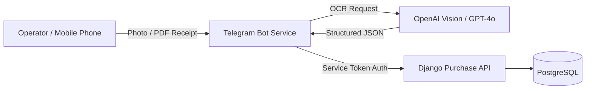

# 03. Business Domain Modules

Business modules (`modules/*`) contain domain-specific logic and data models. Each module is a bounded context that communicates with the platform kernel via DRF endpoints and platform service interfaces.

---

## 1. Assets & Delivery Challans (`modules/assets`, `apps/web/src/app/(platform)/assets`)

### Purpose
Manages physical asset tracking and generates Delivery Challan (DC) paperwork for equipment movement across site locations.

### Key Models (`modules/assets/backend/models/dc.py`)
- **`Site`:** Delivery destination (`name`, `address`, `contact_person`, `contact_phone`).
- **`DeliveryChallan`:** Record of issued paperwork:
  - `dc_number` (e.g. `28/2026-27`)
  - `dc_type` (`returnable` or `non_returnable`)
  - `site` (FK to `Site`, optional)
  - `file` (FK to `storage.StoredFile`)
  - `generated_by` (FK to `User`)
  - `items` (JSON list of delivered items with custom quantities & units)
  - `verification_hash` (SHA-256 digest of the PDF)

### Functional Workflows
- **Free-Text Products:** Bypasses inventory DB validation so users can type arbitrary item names.
- **Custom Units:** Supports custom measurement units (e.g. `2 Kg`, `5 Litre`, `1 Lot`, `10 Nos`, `3 Mtr`).
- **Custom Deliver To:** Text input field for delivery destination details.
- **Template PDF Generation:** Uses `docxtpl` to populate `modules/assets/backend/templates/dc_template.docx` (`DC 26.docx`) and converts it to PDF via LibreOffice Writer.
- **Document Integrity:** Calculates SHA-256 fingerprint on PDF creation and saves it in `verification_hash`.
- **Deletion & Download:** API endpoints support direct PDF downloads (`/api/assets/dcs/{id}/download/`) and deletion (`DELETE /api/v1/assets/dcs/{id}/`).
- **Analytical Dashboard:** Header component (`DCAnalytics`) renders real-time stats (Total DCs, Returnable vs Non-Returnable metrics, Monthly count, and visual distribution bar).

---

## 2. Purchases & Telegram Bot (`modules/purchase`, `services/telegram-bot`)

### Purpose
Automates receipt capture and purchase bill processing via Telegram mobile integration and AI OCR.

### Data Flow

### Key Models (`modules/purchase/backend/models.py`)
- **`PurchaseBill`:** Receipt record (`seller_name`, `total_rate`, `currency`, `status`, `invoice_date`, `raw_ocr_json`, `file`).

---

## 3. Inventory (`modules/inventory`, `apps/web/src/app/(platform)/inventory`)

### Purpose
Repurposed for a **Service Provider Company** model to track internal service tools, spare parts, and service equipment (rather than saleable retail stock).

### Streamlined Scope
- Retail stock selling and low-stock threshold checks (`reorder_level`) have been removed to keep single-operator management lightweight. Focuses on tracking internal service equipment, spare parts, and tools on hand.

---

## 4. Document Management System (`modules/dms`, `apps/web/src/app/(platform)/dms`)

### Purpose
Central repository for uploading, categorizing, and searching company files.

### Features
- Stores files via `StorageService`.
- Generates automatic executive summaries using `AIService`.
- Approval steps (draft, in-review, approved) are removed for single-operator speed.

---

## 5. Maintenance (`apps/web/src/app/(platform)/maintenance`)

### Purpose
Provides system diagnostics, tenant configuration inspection, and AI service usage metrics.

### Key Endpoint
- `getBackendHealth()` calls `/healthz` to verify database, Redis, and storage status.
