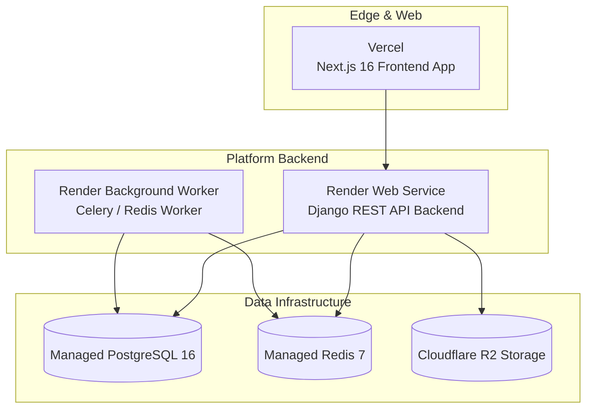

# 07. Deployment & Operations

## Deployment Topology



---

## Local Docker Operations

### Starting Local Infrastructure

```bash
# Start all background containers (Postgres, Redis, Mailpit, Backend, Telegram Bot)
docker-compose up -d

# View status of running containers
docker ps
```

### Container Lifecycle Commands

```bash
# Restart Backend Container (Required after Python code changes)
docker restart bop-backend

# Restart Telegram Bot Container
docker restart bop-telegram-bot

# View container logs
docker logs --tail 100 bop-backend
docker logs --tail 100 bop-telegram-bot
```

---

## Production Deployment Steps

### 1. Database Migrations

Run database migrations against the production PostgreSQL instance before deploying code:

```bash
python manage.py migrate
```

### 2. Frontend Build (Vercel)

Deploy Next.js frontend to Vercel using monorepo scope:

```bash
pnpm --filter web build
```

### 3. Backend Deployment (Render / Docker)

Deploy Django backend via Render Web Service using the `./platform` Dockerfile and environment configuration.
