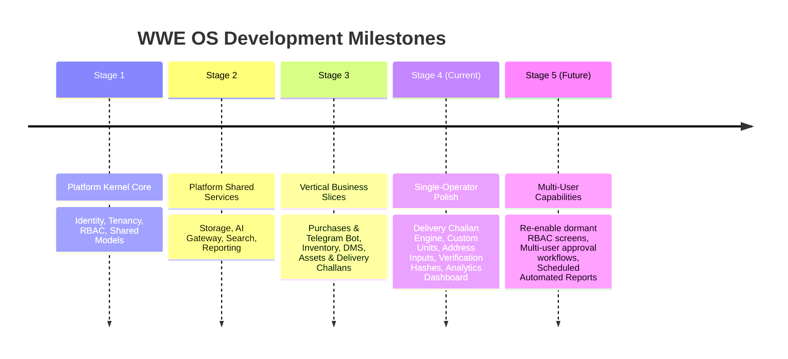

# 08. Development Roadmap

## Project Progression & Milestones

---

## Completed Stages

- **Stage 1 (Kernel Core):** Multi-tenant Django kernel, JWT authentication, tenant isolation middleware, append-only audit logging.
- **Stage 2 (Shared Services):** Local/S3 storage abstraction, AI gateway with token accounting, PostgreSQL full-text search, multi-format reporting.
- **Stage 3 (Vertical Modules):** Receipt capture via Telegram bot, inventory item management, document management storage.
- **Stage 4 (Single-Operator Refinement — Active):**
  - **Delivery Challan System:** Word template dynamic rendering (`DC 26.docx`), free-text item inputs, customizable measurement units (Kg, Litre, Lot, Nos, Mtr), custom delivery address input, SHA-256 verification hash stamping, DC deletion, and live `DCAnalytics` header.
  - **Single-Operator Efficiency:** Streamlined multi-step approval gates and low-stock warnings to maximize single-operator velocity.

---

## Future Roadmap (Stage 5)

1. **Multi-User Role UI Activation:** Re-enable dormant user and role management screens (`admin/users`, `admin/roles`, `admin/audit`) when a second operator joins.
2. **Automated Scheduled Exports:** Add background task queue worker (Celery/Redis) to run automated weekly/monthly reporting exports.
3. **Advanced Vector Search:** Integrate vector embeddings behind `SearchService` for semantic document discovery in DMS.
