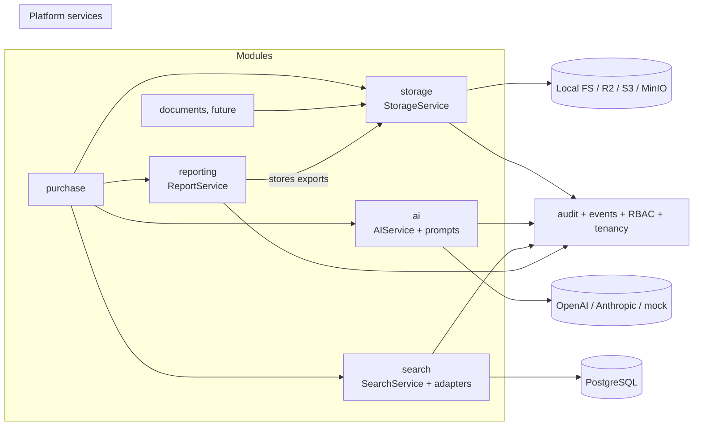

# Platform services — storage, AI, search, reporting

**Status: built + tested (2026-07-21).** Four reusable capabilities inside the
platform kernel. They contain zero business logic; every module (Purchase,
Documents, HR integration, Inventory, …) consumes them instead of building
its own infrastructure. All four follow the kernel recipe: models →
service → API, permissions from the platform registry, events on the shared
bus, audit via subscribers, tenant isolation from `TenantOwnedModel`.



| Service   | Endpoints                                                                                | Permissions                                         |
| --------- | ---------------------------------------------------------------------------------------- | --------------------------------------------------- |
| storage   | `/api/v1/storage/files/` (+`download`, `url`), `/api/v1/storage/download/?token=`        | `storage.read` / `storage.write` / `storage.manage` |
| ai        | `/api/v1/ai/generate/`, `/api/v1/ai/usage/`, `/api/v1/ai/prompts/`, `/api/v1/ai/health/` | `ai.use` / `ai.manage`                              |
| search    | `/api/v1/search/`, `/api/v1/search/autocomplete/`                                        | `search.use` + per-index adapter permission         |
| reporting | `/api/v1/reporting/exports/` (+`url`)                                                    | `reporting.export` / `reporting.view`               |

## 1. Storage (`platform/storage`)

- **Provider abstraction** (`providers.py`): `StorageProvider` ABC with
  `LocalStorageProvider` (dev/tests; signed URLs are Django-signed expiring
  tokens served by `/api/v1/storage/download/`) and `S3CompatibleProvider`
  (Cloudflare R2, AWS S3, MinIO — same API, lazy boto3 import). Azure/GCS =
  one new class.
- **Service** (`services.py`): validation (size limit, MIME allowlist, empty
  file), filename sanitization, sha256 integrity (`verify_integrity`),
  tenant-namespaced keys `t/<tenant>/<module>/<yyyy>/<mm>/<uid>-<name>`,
  soft-deleted metadata rows (`StoredFile`), `FILE_STORED`/`FILE_DELETED`
  events → audit.
- **Virus-scan integration point**: `StoredFile.scan_status` + a future
  scanner subscribing to `FILE_STORED` and calling `mark_scan_result`.
- **Versioning**: bucket-level on S3-compatible backends
  (`supports_versioning`); the service never overwrites keys, so provider
  versioning is optional, not load-bearing.

## 2. AI gateway (`platform/ai`)

- **One gate**: modules call `AIService.generate(...)`; nothing else in the
  repo may import an AI SDK or provider URL (review rule).
- **Routing** (`providers.py`): `MODELS` table maps model name → provider +
  USD/1M-token costs (visibility, not billing — re-verify before invoicing
  anyone). Providers: OpenAI + Anthropic over httpx, `mock` (deterministic,
  free, default). Gemini/local models = one class + table rows.
- **Resilience**: retry with backoff on retryable errors (429/5xx/network),
  timeout via `AI_TIMEOUT_SECONDS`, optional `AI_FALLBACK_MODEL` on final
  failure.
- **Accounting**: every call (success, cached, failed) writes `AIUsage`
  (tenant, module, use_case, tokens, cost, latency) — `/api/v1/ai/usage/`
  aggregates by model and module.
- **Controls**: per-tenant hourly cap (`AI_TENANT_HOURLY_LIMIT` → 429),
  response cache (`cache_ttl` per call, key = model+prompt hash).

## 3. Prompt library (`platform/ai/prompts.py`)

Code-defined, versioned prompts — reviewed and shipped like permissions, not
edited in a database. `PromptDef(key, version, category, system, user,
variables, model_hint)`; registration validates that declared variables
exactly match template placeholders (no drift), rendering validates the
supplied variables both ways. Modules register prompts in `AppConfig.ready()`
and call `AIService.generate(prompt_key=...)`. Analytics: `AIUsage.use_case`
records the prompt key. Catalog: `/api/v1/ai/prompts/`.

## 4. Search (`platform/search`)

- **Write contract**: modules register a `SearchAdapter` (index name, gating
  permission, object→document mapping, optional rebuild queryset) in
  `ready()`, then call `SearchService.upsert/remove` from their own event
  subscribers. The platform never imports a module.
- **Query path**: PostgreSQL full-text (`SearchVector` A/B weights +
  `SearchRank`) on Postgres; portable icontains ranking elsewhere (sqlite
  tests). At scale: add a stored tsvector column + GIN index, or swap the
  internals for Meilisearch/OpenSearch — callers unchanged.
- **Semantics**: tenant-scoped always; permission-aware per index (results
  from an index are invisible without its permission); filters on `extra`
  JSON; facet counts; pagination; prefix autocomplete; excerpt around the
  first match.
- **Rebuild**: `python manage.py search_rebuild [index]` (synchronous admin
  operation) → `SEARCH_REINDEXED` event.
- **Vector search**: reserved as a provider-internal extension — embedding
  columns/ANN indexes slot behind `SearchService` without contract changes.

## 5. Reporting (`platform/reporting`)

- **Contract**: modules build a `ReportSpec` (columns + row dicts + filter
  echo + optional watermark) behind their own permissions; the platform
  renders CSV / XLSX (openpyxl) / HTML (print-ready template) / PDF
  (reportlab: branded header, repeating table header, page footer,
  watermark).
- **Branding** comes from the tenant (company name) + generation metadata;
  charts are a future format upgrade (frontend owns charts today).
- **Export pipeline**: `ReportService.export` renders → stores through
  `StorageService` (reporting never touches a provider) → `ReportExport`
  history row → `REPORT_EXPORTED` event → audit. History + signed download
  at `/api/v1/reporting/exports/`.
- **Scheduling**: deliberately absent (no async runtime yet); a future
  scheduler calls the same `export()`.

## Extension guides

**New storage provider** — subclass `StorageProvider` in
`storage/providers.py`, implement the five methods, add a branch in
`get_provider()`. Nothing else changes.

**New AI provider/model** — subclass `AIProvider` (one HTTP call + error
classification), add it to `PROVIDERS`, add model rows to `MODELS` with
costs. Modules keep calling `AIService`.

**New search engine** — replace the internals of `SearchService._ranked`
(or introduce a provider class behind the service) keeping
`upsert/remove/search/rebuild` signatures; adapters and callers unchanged.

**New report format** — one renderer function in `reporting/renderers.py` +
one `FORMATS` entry (+ `ExportFormat` choice).

**Make a module searchable** (pattern):

```python
# modules/<m>/backend/apps.py ready():
from search.registry import SearchAdapter, register
register(SearchAdapter(
    index="purchase-bills",
    label="Purchase bills",
    permission="purchase.bill.read",
    to_document=lambda bill: {
        "doc_id": str(bill.id), "title": bill.seller_name,
        "body": f"{bill.currency} {bill.total_rate}",
        "extra": {"status": bill.status}, "url": f"/purchases/bills/{bill.id}",
    },
    queryset=lambda: PurchaseBill.objects.all(),
))
# then upsert/remove from the module's own event subscribers
```

## Security notes

- Tenant isolation: all four services store tenant-owned rows; queries are
  tenant-filtered at the service AND viewset layer; storage keys are
  tenant-prefixed.
- Signed downloads: Django-signed tokens carry `{key, exp}` under a
  dedicated salt; tampering or expiry → 403. S3 presigned URLs inherit the
  provider's signature.
- Credentials: provider keys live in env only (`OPENAI_API_KEY`,
  `ANTHROPIC_API_KEY`, `STORAGE_S3_*`); the AI health endpoint reports
  configured/not, never values.
- Uploads: size cap, MIME allowlist, filename sanitization, hash recorded;
  scan hook for a future AV service.
- Audit: file store/delete, report export, reindex all land in the audit
  trail with actor + tenant.
