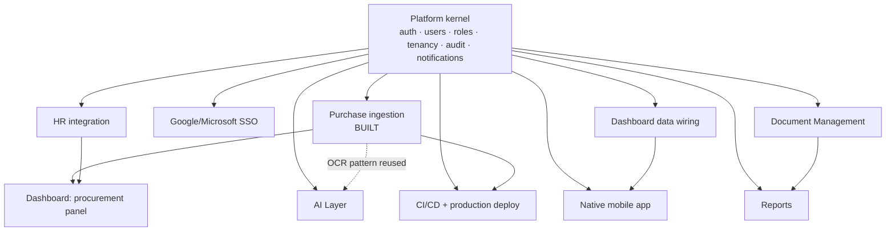

# WWE OS — Development Roadmap

The master planning document: build order, dependencies, risk, cost, time,
branching, documentation structure, readiness checklist, and an honest
review of what's missing and what could be better. Companion to
`docs/specs/*.md` (technical detail per module) and
`docs/roadmap/single-operator-plan.md` (product direction).

**How to read "Status"**: _Built_ means real code exists, is tested, and
passed the full verification gate (§ below) in this repository. _Planned_
means a spec exists (`docs/specs/`) but no code. Nothing in between is
claimed — a partial build is labeled partial, explicitly.

---

## 1. What's actually built, right now

| Area                                                                                                                           | Status                                                                                                             |
| ------------------------------------------------------------------------------------------------------------------------------ | ------------------------------------------------------------------------------------------------------------------ |
| Platform kernel (auth, users, roles, permissions, tenancy, audit, notifications)                                               | **Built.** Real cookie-based BFF auth (login/logout/refresh), tenant auto-bootstrap on first registration.         |
| Frontend shell (sidebar, header, command palette, login, executive dashboard UI)                                               | **Built.** Renders, builds clean, KPIs/procurement/approvals/alerts/activity backed by live Purchase data.         |
| Purchase (bill ingestion + review queue + vendor directory + payment tracking)                                                 | **Built.** 27 tests, full verification gate green, verified against a live running server (not just mocked tests). |
| Service-to-service auth (`ServiceTokenAuthentication`)                                                                         | **Built.** Reusable by every future ingestion channel.                                                             |
| Design system (motion tokens, elevation, semantic colors, `DataTable`/`Toaster` primitives)                                    | **Built.** WCAG-checked contrast, documented in `docs/design/design-bible.md`.                                     |
| Google/Microsoft SSO                                                                                                           | **Not built.** Email+password auth is real; social sign-in is still a gap.                                         |
| Everything else in the original brief (DMS, Reports, AI Layer, full Workflow Engine, Mobile app, CI/CD, production deployment) | **Not built.** Specs exist in `docs/specs/`.                                                                       |

56 tests total, 0 failures, as of this stage.

---

## 2. Dependency graph



Reading this: the kernel is the one hard dependency everything else has
(already satisfied — it's built). Beyond that, most modules are
**independent of each other**, not sequentially blocking — DMS doesn't wait
on Reports, AI Layer doesn't wait on Mobile. The one soft dependency worth
respecting: Reports is more valuable once there's a second data-owning
module besides Purchase to report on.

---

## 3. Recommended build order

This reorders the brief's module list by _actual_ dependency and
single-operator value, not by the order it happened to be listed in.

1. **Purchase ingestion** — done.
2. ~~Frontend: Purchase review queue UI~~ — **done.** Real `DataTable`
   review queue, confirm/reject, vendor directory (CRUD + GST number),
   payment tracking (mark-paid), dashboard activity/alerts wired to it.
3. ~~Tenant/company bootstrap~~ — **done.** First registration auto-creates
   the tenant and becomes Owner.
4. ~~Dashboard data wiring~~ — **done**, for everything Purchase can supply
   (KPIs, procurement summary, pending approvals, operational alerts,
   recent activity). Areas with no backing module (Financial, People,
   Inventory, Contracts) still read honest `—`, correctly — they need their
   own modules first, not more Purchase wiring.
5. **Google/Microsoft SSO** — email+password auth is real and working;
   social sign-in is the one auth gap left. Smaller now that the auth
   plumbing (BFF cookies, refresh, route guard) already exists.
6. **HR integration, Phase 0–1** (discovery + read-only API) — per
   `docs/specs/hr-integration-strategy.md`; the biggest unknown, start early
   so its real scope is known before committing to a timeline.
7. **Document Management** — the next module with clear standalone value
   and no unmet dependencies.
8. **CI/CD** (`infrastructure/github-actions/`) — currently zero automated
   checks run on push; every gate described in this document is manual
   today. Should move up in priority as soon as more than one contributor
   (human or AI session) touches the repo.
9. **Native mobile app** — start once there's a second real screen (beyond
   dashboard + purchase) worth putting on a phone.
10. **Reports, AI Layer, remaining apps** — as each becomes the next highest
    real-world value, not in a fixed order.

---

## 4. Time estimates

Honest ranges, not commitments — this platform has one contributor context
(you + AI pairing), so "days" here means focused work sessions, not
calendar time with a team.

| Item                                                  | Estimate  | Confidence                                                                          |
| ----------------------------------------------------- | --------- | ----------------------------------------------------------------------------------- |
| Google/Microsoft SSO                                  | 1–2 days  | High — pattern is well understood, provider SDK integration is the only unknown     |
| HR integration Phase 0 (discovery)                    | 0.5 day   | High — it's a conversation/investigation, not code                                  |
| HR integration Phase 1 (read-only API)                | 2–5 days  | **Low** — entirely depends on what Phase 0 discovers                                |
| Document Management (core CRUD + versions, no search) | 3–5 days  | Medium                                                                              |
| CI/CD workflow                                        | 0.5–1 day | High                                                                                |
| AI Layer gateway                                      | 2–3 days  | Medium — depends on confirming actual model availability/pricing first              |
| Reports module (core, no scheduling)                  | 3–5 days  | Medium                                                                              |
| Native mobile app (dashboard + purchase review only)  | 5–10 days | **Low** — first mobile screens always take longer than later ones                   |
| Full production deployment (Render + Vercel, live)    | 1–2 days  | Medium — designed, execution risk is in account/DNS/environment specifics, not code |

---

## 5. Risk analysis

| Risk                                                                      | Likelihood                                  | Impact                                                                     | Mitigation                                                                                                                      |
| ------------------------------------------------------------------------- | ------------------------------------------- | -------------------------------------------------------------------------- | ------------------------------------------------------------------------------------------------------------------------------- |
| Ingested documents have no durable storage (Telegram-hosted URL only)     | **Certain (already true)**                  | Medium — original files could become unrecoverable; extracted data is safe | Build `platform/storage` before ingestion volume matters; flagged in `docs/specs/document-ingestion.md`                         |
| "GPT-5 mini" as specified may not be a real/available model               | Possible                                    | Low — the gateway design doesn't hardcode it                               | Verify actual OpenAI model availability/pricing before AI Layer implementation; flagged in `docs/specs/ai-layer.md`             |
| No CI — every gate is run manually                                        | **Certain (already true)**                  | Medium — a regression could ship unnoticed                                 | Build CI early (§ 3, item 7)                                                                                                    |
| HR integration scope is unknown (no discovery done yet)                   | Certain                                     | Medium — time estimate for this phase is genuinely low-confidence          | Phase 0 discovery before any commitment (§ HR spec)                                                                             |
| Docker daemon unavailable in this session — full container run unverified | Known, scoped                               | Low — `docker compose config` validated; migrations are DB-agnostic        | Run `docker compose up -d --build` + smoke test at the next opportunity Docker is available                                     |
| Single point of failure (one operator, no backup admin)                   | Inherent to the confirmed product direction | Medium                                                                     | Accepted tradeoff per `docs/roadmap/single-operator-plan.md` — RBAC/multi-user is dormant, not deleted, for exactly this reason |

---

## 6. Missing components review

Real gaps found or already known, stated plainly:

1. **No durable document storage.** `platform/storage` is README-only;
   ingested bills reference a temporary, channel-hosted URL. See risk table.
2. **No CI/CD.** Every check in § 7 below is run manually. A push to `main`
   today runs nothing automatically.
3. **No production deployment has been executed.** Render/Vercel configs
   are designed (`docs/deployment/backend.md`) but no live deployment
   exists — this repository has never served real production traffic.
4. **`packages/sdk`, `packages/utils`, `packages/config` are empty
   placeholders** — fine for now (nothing needs them yet), but will need
   real content once the mobile app or a second frontend consumer exists.
5. **No performance, load, or dedicated security testing** — see
   `docs/specs/testing-strategy.md` §§ 15–16.
6. **Vendor auto-matching is exact-name-only** — a minor, known limitation
   in the Purchase module (`docs/specs/purchase.md` § 20).
7. **No Google/Microsoft SSO** — email+password auth is real; social
   sign-in is the remaining auth gap (§ 3, item 5).

---

## 7. Production readiness checklist

| Item                                                                                            | Status                                                                                  |
| ----------------------------------------------------------------------------------------------- | --------------------------------------------------------------------------------------- |
| `ruff check` clean (frontend + backend)                                                         | ✅ Pass                                                                                 |
| `manage.py check` clean                                                                         | ✅ Pass                                                                                 |
| `makemigrations --check --dry-run` clean                                                        | ✅ Pass                                                                                 |
| `pytest` — 82/82 passing (incl. workflow engine, observability, ingest dedupe)                  | ✅ Pass                                                                                 |
| `manage.py spectacular` — 0 warnings/errors                                                     | ✅ Pass                                                                                 |
| `manage.py check --deploy` — 0 issues                                                           | ✅ Pass                                                                                 |
| `pnpm build` (frontend)                                                                         | ✅ Pass (verified earlier this session)                                                 |
| `docker compose config --quiet`                                                                 | ✅ Pass                                                                                 |
| Live `docker compose up` + container smoke test                                                 | ⬜ **Not run** (Docker daemon unavailable this session)                                 |
| Tenant/company bootstrap flow                                                                   | ✅ **Done** — first registration auto-bootstraps the tenant and becomes Owner           |
| Durable document storage                                                                        | 🟡 **Capability built** (`platform/storage`, local + R2/S3) — bot/module wiring pending |
| CI pipeline running these checks automatically                                                  | ✅ **Done** — `test-backend` job runs `manage.py check` + pytest on every push/PR       |
| Production deployment executed (Render/Vercel/DB provisioned)                                   | ⬜ **Not done** (§ 6.3)                                                                 |
| Real domain, HTTPS, `DJANGO_ALLOWED_HOSTS`/`CORS_ALLOWED_ORIGINS` set for it                    | ⬜ **Not done** — depends on the above                                                  |
| Secrets rotated from local-dev defaults (`INGESTION_SERVICE_TOKENS`, `DJANGO_SECRET_KEY`, etc.) | ⬜ **Not done** — `.env.example` defaults are for local dev only, never for production  |

**This platform is not production-ready today.** It is a verified,
tested foundation with one working end-to-end feature (Purchase ingestion).
The unchecked items above are the actual remaining work before "production"
is an honest claim.

---

## 8. Cost analysis

Modeled estimates, not quotes — infrastructure pricing changes, and this
should be re-checked against current provider pricing before committing to
a budget.

| Item                                                               | Estimated monthly cost                                | Notes                                                                                                                                                                                                                            |
| ------------------------------------------------------------------ | ----------------------------------------------------- | -------------------------------------------------------------------------------------------------------------------------------------------------------------------------------------------------------------------------------- |
| Render (backend, hobby/starter tier)                               | $0–7                                                  | Free tier sleeps on inactivity; a paid starter tier avoids that for a real single-operator user                                                                                                                                  |
| Vercel (frontend)                                                  | $0                                                    | Free tier is sufficient at this scale                                                                                                                                                                                            |
| Managed PostgreSQL                                                 | $0–15                                                 | Depends on provider; Render's own managed Postgres or a free-tier alternative (Supabase, Neon) both plausible                                                                                                                    |
| Redis                                                              | $0                                                    | Render's free Redis tier or a small managed instance                                                                                                                                                                             |
| OpenAI (OCR, vision calls)                                         | **Needs verification**                                | Depends on actual receipt volume × actual current vision-model pricing; the brief's $5–6/month target is achievable at low volume (tens of receipts/month) but must be checked against real, current OpenAI pricing, not assumed |
| Anthropic (Claude Haiku daily insights, Sonnet for rare reasoning) | **Needs verification**                                | Same caveat — daily-batch Haiku calls are cheap by design (§ `ai-layer.md`), but confirm current pricing before committing to a number                                                                                           |
| Telegram Bot API                                                   | $0                                                    | Free                                                                                                                                                                                                                             |
| **Total estimated range**                                          | **$0–25/month infra + AI costs pending verification** | The infra side is genuinely near-zero at this scale; AI is the one line item that needs real numbers before the brief's $5–6/month target can be confirmed or adjusted                                                           |

---

## 9. Git branch strategy

Recommended, given a single primary contributor (you, pairing with AI
sessions) rather than a large team:

- **Trunk-based, not Git Flow.** `main` is always deployable (once § 7 is
  fully green). No long-lived `develop` branch — it adds process overhead
  this team size doesn't need.
- **Short-lived feature branches per stage/module**: `feat/<module>-<scope>`
  (e.g. `feat/purchase-review-ui`, `feat/sso-google`), matching the
  Conventional Commits scope already used in commit messages. Merge to
  `main` when a stage's verification gate is green — this repo's own Stage
  1/Stage 2 work is the reference: `feat/platform-foundation` branch,
  merged once the full gate passed.
- **No release branches** — not needed until there's a reason to support
  multiple production versions simultaneously (there isn't one yet).
- **Tag on deploy**, not on merge — a lightweight `vYYYY.MM.DD` or semantic
  tag when something is actually pushed to production, so "what's live"
  is always answerable from git alone.

---

## 10. Documentation structure

```
docs/
  architecture/         Platform kernel, auth, RBAC — how the built system works.
  api/                  The API reference (platform-api.md).
  deployment/            How to run/deploy the backend.
  design/                The design bible — UI law.
  development/            Onboarding guide.
  modules/               Business blueprints per module (purpose, KPIs, permissions) —
                         written before implementation, define what a module is for.
  specs/                 Technical specs per module (this stage's addition) — the
                         20-point engineering detail underneath each blueprint,
                         honestly marked built vs. planned.
  roadmap/               Product direction (single-operator-plan.md) and this
                         document — build order, risk, cost, readiness.
  adr/                   Architecture Decision Records for anything structural.
```

The split between `modules/` (business blueprint) and `specs/` (technical
spec) is deliberate: a blueprint answers "what is this for and who uses
it," written once, rarely changes. A spec answers "how is this actually
built," and should be kept honest about built-vs-planned as work
progresses — `modules/*.md` files are not rewritten as code lands; the
corresponding `specs/*.md` file is.

---

## 11. Architecture review

**What's working well:**

- The layered pattern (api → service → repository → model, one capability
  per Django app, modules never importing each other) held up exactly as
  designed when a second real feature (Purchase) was built on it — no
  platform code needed to change shape, only extend (new `MODULE_APPS`
  entry, new permission registry, new event subscribers).
- The event bus + audit-via-subscription pattern meant Purchase's audit
  trail required zero changes to `platform/audit` — it just subscribed.
  This is the architecture doing its job.
- The error contract, once actually exercised end-to-end (not just unit
  tested), revealed a real inconsistency (DRF's default 400 vs. the
  documented 422) that's now fixed platform-wide, not just patched for one
  view. This is what "systematic debugging" is supposed to produce — a
  session tests, finds a real gap, and fixes it at the right layer, not
  where it happened to surface.

**What's genuinely weak or unproven:**

- **Zero features have been used by a real second person or in a real
  multi-tenant scenario.** The tenant-isolation tests pass, but they're
  the only evidence this works — there is no production traffic to learn
  from yet.
- **The permission-sync ordering fix (`MODULE_APPS` placed before `roles`
  in `INSTALLED_APPS`) is correct but fragile** — it depends on list order
  in one settings file being remembered by whoever adds the next module.
  Worth a code comment (added) and, eventually, a test that asserts Owner's
  permission count matches the total Permission row count, so a future
  ordering mistake fails loudly instead of silently under-granting Owner.
- **The single-tenant assumption in `_resolve_ingest_tenant()`** works
  today and will break the moment a second tenant is created for any
  reason (including accidentally, via the Django admin) — it fails loudly
  (a `ConflictError`), which is the right failure mode, but it is a real
  constraint worth remembering before, e.g., ever testing against a second
  company's data in the same database.

**Overall**: the foundation is sound and the one real feature built on it
proves the pattern, not just the theory. The gaps are honest and known, not
hidden — which is the state you want before scaling up module count.

---

## 12. Suggestions for improvement

1. **Fix the tenant/company bootstrap gap next**, before building more
   features on top of an assumption ("a tenant exists") that isn't
   actually guaranteed by any code path yet.
2. **Add a test that Owner's permission set equals the full Permission
   table** — turns the fragile `INSTALLED_APPS` ordering (§ 11) into a
   loud failure instead of a silent one if it's ever gotten wrong.
3. **Stand up CI before adding a third module** — the manual verification
   gate is doing real work today; automating it is cheap now and expensive
   to retrofit once there's more surface area to break.
4. **Verify AI provider pricing/model availability before writing any AI
   Layer code** — the brief's cost target and model names need confirming
   against current reality, not this document's possibly-stale knowledge.
5. **Build the Purchase review queue frontend next** — it's the single
   highest ratio of "user-visible value" to "already-done backend work"
   available right now.
